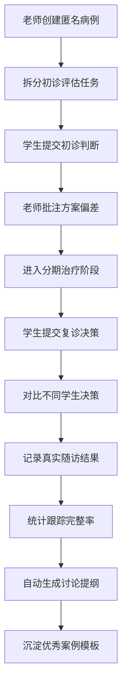
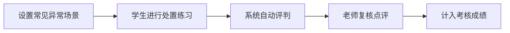

## 1. 产品概述

口腔正畸教研室教学管理平台，面向带教老师、实习医生和学生，用于共同追踪教学病例，从"会看方案"延伸到"会跟方案"。平台强调学习过程、判断依据和阶段追踪能力的培养，整体调性偏专业训练和复盘。

- 目标用户：带教老师、实习医生、口腔医学生
- 核心价值：通过病例追踪式教学，培养学生的临床决策能力和方案执行力
- 产品定位：专业医学教学训练平台，非患者自助系统

## 2. 核心功能

### 2.1 用户角色

| 角色 | 登录方式 | 核心权限 |
|------|----------|----------|
| 带教老师 | 账号登录 | 创建病例、发布教学方案、批注点评、查看考核数据、管理资料归档 |
| 实习医生 | 账号登录 | 查看病例、提交阶段判断、参与复诊决策、查看个人考核数据 |
| 学生 | 账号登录 | 学习病例、提交处理建议、完成异常处置练习、查看学习进度 |

### 2.2 功能模块

1. **病例库**：匿名教学病例创建、分类筛选、病例详情、优秀案例模板
2. **教学方案**：初诊评估任务、分期治疗任务拆分、阶段目标设定
3. **随访日志**：真实随访时间线、照片挂接、模型观察重点记录
4. **批注点评**：老师逐条批注方案偏差、学生复诊决策对比
5. **考核面板**：学生跟踪完整率统计、常见异常处置练习、学习数据可视化
6. **资料归档**：病例讨论提纲自动生成、优秀案例沉淀、资料分类管理

### 2.3 页面详情

| 页面名称 | 模块名称 | 功能描述 |
|----------|----------|----------|
| 登录页 | 身份认证 | 角色选择、账号登录、密码重置入口 |
| 工作台/首页 | 数据概览 | 待办任务、学习进度、病例统计、快捷入口 |
| 病例库列表 | 病例库 | 病例分类筛选、搜索、新建病例入口 |
| 病例详情 | 病例库 | 病例基本信息、诊断资料、治疗时间线 |
| 教学方案 | 教学方案 | 初诊评估任务、分期治疗阶段、任务分配 |
| 阶段任务详情 | 教学方案 | 任务要求、学生提交区、判断依据填写 |
| 随访日志 | 随访日志 | 时间线展示、随访记录、照片/模型挂接 |
| 批注点评 | 批注点评 | 老师批注列表、方案偏差标记、学生决策对比 |
| 考核面板 | 考核面板 | 跟踪完整率统计、异常处置练习、成绩排行 |
| 资料归档 | 资料归档 | 讨论提纲、优秀案例、资料分类管理 |

## 3. 核心流程

### 3.1 病例教学主流程

带教老师创建匿名教学病例，拆分初诊评估与分期治疗任务，学生提交阶段判断与处理建议，老师逐条批注方案偏差，记录真实随访时间线，最终沉淀为优秀案例。

### 3.2 异常处置练习流程

## 4. 用户界面设计

### 4.1 设计风格

- **主色调**：深海蓝 (#1a365d) — 代表专业、沉稳、医学严谨
- **辅助色**：铜琥珀 (#d97706) — 代表温暖、专注、教学引导
- **中性色**：石板灰系列 — 层次分明，信息密度高但有序
- **按钮风格**：直角微圆角（4px），扁平设计，强调专业感
- **字体**：
  - 标题：思源宋体 / Noto Serif SC — 专业学术感
  - 正文：思源黑体 / Noto Sans SC — 清晰易读
  - 数据/编号：等宽字体 — 精确严谨
- **布局风格**：卡片式布局，左侧导航 + 主内容区 + 右侧信息面板
- **图标风格**：线性图标（lucide），简洁专业

### 4.2 页面设计概述

| 页面名称 | 模块名称 | UI元素 |
|----------|----------|--------|
| 登录页 | 身份认证 | 医学插画背景、角色选择卡片、表单居中布局 |
| 工作台 | 数据概览 | 数据卡片网格、待办任务列表、快捷操作区 |
| 病例库 | 病例列表 | 筛选侧边栏、病例卡片网格、搜索顶栏 |
| 病例详情 | 病例信息 | 标签页导航、信息卡片、时间线组件 |
| 教学方案 | 阶段任务 | 时间轴布局、任务卡片、状态指示器 |
| 批注点评 | 对比视图 | 双栏对比布局、批注气泡、偏差高亮标记 |
| 考核面板 | 数据统计 | 图表组件、进度条、排行榜表格 |
| 资料归档 | 文档管理 | 文件夹树状结构、文档卡片、分类标签 |

### 4.3 响应式

- 桌面端优先设计（1280px+）
- 平板端适配（768px-1279px）：侧边栏可收起，内容区自适应
- 移动端（<768px）：底部导航栏，堆叠式布局，核心功能优先
- 触控优化：增大点击区域，支持滑动操作

### 4.4 交互与动效

- 页面切换：淡入淡出过渡
- 卡片悬停：微妙上浮 + 阴影加深
- 数据加载：骨架屏占位
- 批注标记：脉冲动画提示
- 时间线：滚动触发逐步呈现
