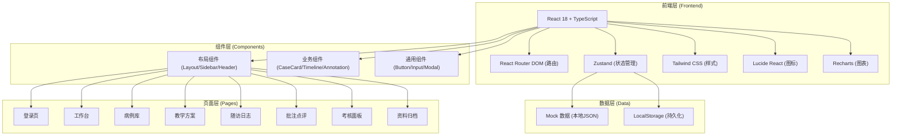
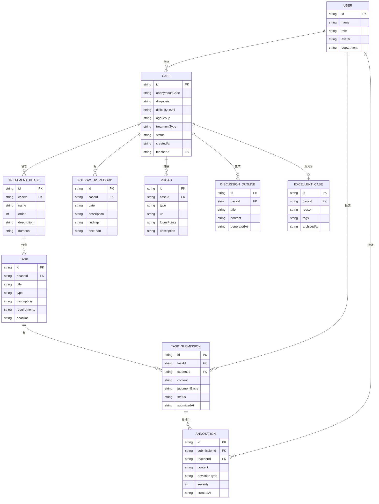

## 1. 架构设计



## 2. 技术描述

- **前端框架**：React 18 + TypeScript
- **构建工具**：Vite 5
- **路由管理**：React Router DOM v6
- **状态管理**：Zustand
- **样式方案**：Tailwind CSS 3
- **图标库**：Lucide React
- **图表库**：Recharts
- **数据方案**：Mock 数据 + LocalStorage 持久化（纯前端演示）
- **初始化模板**：react-ts (Vite + React + TypeScript + Tailwind + Zustand)

## 3. 路由定义

| 路由路径 | 页面名称 | 说明 |
|----------|----------|------|
| `/login` | 登录页 | 角色选择与身份认证 |
| `/dashboard` | 工作台 | 数据概览与待办任务 |
| `/cases` | 病例库列表 | 病例浏览与筛选 |
| `/cases/:id` | 病例详情 | 病例信息与时间线 |
| `/teaching-plan` | 教学方案 | 阶段任务管理 |
| `/teaching-plan/:taskId` | 阶段任务详情 | 任务提交与查看 |
| `/follow-up` | 随访日志 | 随访时间线 |
| `/annotations` | 批注点评 | 批注与决策对比 |
| `/assessment` | 考核面板 | 数据统计与练习 |
| `/archive` | 资料归档 | 文档与案例管理 |

## 4. 数据模型

### 4.1 实体关系图



### 4.2 核心数据类型

```typescript
// 用户类型
type UserRole = 'teacher' | 'intern' | 'student';

interface User {
  id: string;
  name: string;
  role: UserRole;
  avatar: string;
  department: string;
}

// 病例类型
type CaseDifficulty = 'easy' | 'medium' | 'hard';
type CaseStatus = 'draft' | 'in_progress' | 'completed' | 'archived';

interface Case {
  id: string;
  anonymousCode: string;
  diagnosis: string;
  difficultyLevel: CaseDifficulty;
  ageGroup: string;
  treatmentType: string;
  status: CaseStatus;
  description: string;
  createdAt: string;
  teacherId: string;
  phases: TreatmentPhase[];
  followUpRecords: FollowUpRecord[];
  photos: CasePhoto[];
}

// 治疗阶段
interface TreatmentPhase {
  id: string;
  caseId: string;
  name: string;
  order: number;
  description: string;
  duration: string;
  tasks: Task[];
}

// 任务
type TaskType = 'initial_assessment' | 'stage_judgment' | 'treatment_suggestion' | 'followup_decision';

interface Task {
  id: string;
  phaseId: string;
  title: string;
  type: TaskType;
  description: string;
  requirements: string;
  deadline: string;
  status: 'pending' | 'in_progress' | 'completed';
}

// 任务提交
interface TaskSubmission {
  id: string;
  taskId: string;
  studentId: string;
  studentName: string;
  content: string;
  judgmentBasis: string;
  status: 'submitted' | 'reviewed' | 'needs_revision';
  submittedAt: string;
  annotations: Annotation[];
  score?: number;
}

// 批注
type DeviationType = 'diagnosis' | 'treatment_plan' | 'timing' | 'method' | 'other';

interface Annotation {
  id: string;
  submissionId: string;
  teacherId: string;
  content: string;
  deviationType: DeviationType;
  severity: 1 | 2 | 3;
  createdAt: string;
}

// 随访记录
interface FollowUpRecord {
  id: string;
  caseId: string;
  date: string;
  visitNumber: number;
  description: string;
  findings: string;
  nextPlan: string;
  photos: string[];
}

// 病例照片
type PhotoType = 'intraoral' | 'extraoral' | 'xray' | 'model' | 'others';

interface CasePhoto {
  id: string;
  caseId: string;
  type: PhotoType;
  url: string;
  thumbnail: string;
  focusPoints: string;
  description: string;
  uploadedAt: string;
}

// 考核数据
interface StudentAssessment {
  studentId: string;
  studentName: string;
  totalCases: number;
  completedCases: number;
  completionRate: number;
  averageScore: number;
  exerciseCount: number;
  exerciseAccuracy: number;
}

// 异常处置练习
interface AbnormalCaseExercise {
  id: string;
  title: string;
  description: string;
  scenario: string;
  options: string[];
  correctAnswer: number;
  explanation: string;
  difficulty: CaseDifficulty;
}

// 讨论提纲
interface DiscussionOutline {
  id: string;
  caseId: string;
  title: string;
  sections: OutlineSection[];
  generatedAt: string;
}

interface OutlineSection {
  title: string;
  points: string[];
}

// 优秀案例
interface ExcellentCase {
  id: string;
  caseId: string;
  caseName: string;
  reason: string;
  tags: string[];
  archivedAt: string;
}
```

## 5. 项目结构

```
src/
├── components/          # 通用组件
│   ├── layout/         # 布局组件
│   │   ├── Layout.tsx
│   │   ├── Sidebar.tsx
│   │   └── Header.tsx
│   ├── common/         # 通用UI组件
│   │   ├── Button.tsx
│   │   ├── Card.tsx
│   │   ├── Badge.tsx
│   │   ├── Modal.tsx
│   │   ├── Input.tsx
│   │   └── Select.tsx
│   └── business/       # 业务组件
│       ├── CaseCard.tsx
│       ├── Timeline.tsx
│       ├── Annotation.tsx
│       ├── ProgressBar.tsx
│       └── StatCard.tsx
├── pages/              # 页面组件
│   ├── Login.tsx
│   ├── Dashboard.tsx
│   ├── CaseList.tsx
│   ├── CaseDetail.tsx
│   ├── TeachingPlan.tsx
│   ├── TaskDetail.tsx
│   ├── FollowUp.tsx
│   ├── Annotations.tsx
│   ├── Assessment.tsx
│   └── Archive.tsx
├── store/              # 状态管理
│   ├── useAuthStore.ts
│   ├── useCaseStore.ts
│   └── useUiStore.ts
├── data/               # Mock数据
│   ├── cases.ts
│   ├── users.ts
│   └── assessment.ts
├── types/              # 类型定义
│   └── index.ts
├── utils/              # 工具函数
│   ├── date.ts
│   └── format.ts
├── App.tsx
├── main.tsx
└── index.css
```

## 6. 状态管理设计

### 6.1 认证状态 (useAuthStore)

```typescript
interface AuthState {
  currentUser: User | null;
  isAuthenticated: boolean;
  login: (username: string, password: string, role: UserRole) => void;
  logout: () => void;
}
```

### 6.2 病例状态 (useCaseStore)

```typescript
interface CaseState {
  cases: Case[];
  currentCase: Case | null;
  submissions: TaskSubmission[];
  isLoading: boolean;
  fetchCases: (filters?) => void;
  fetchCaseDetail: (id: string) => void;
  submitTask: (taskId: string, data: SubmissionData) => void;
  addAnnotation: (submissionId: string, data: AnnotationData) => void;
}
```

### 6.3 UI状态 (useUiStore)

```typescript
interface UiState {
  sidebarCollapsed: boolean;
  toggleSidebar: () => void;
  activeTab: string;
  setActiveTab: (tab: string) => void;
}
```
